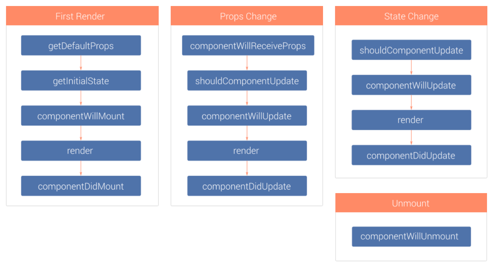
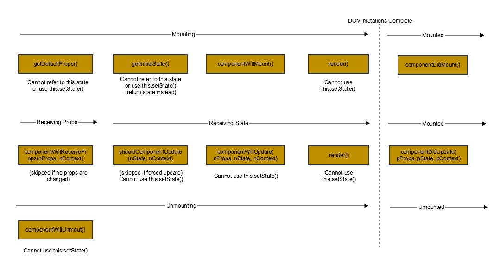

# React Component LifeCycle


## Recap & Intro
- Last week focused on:
    - React Basics
    - JSX
	- State
	- Props
	- Component Composition
- Tonight we'll be discussing React LifeCycle


## Agenda

- Cover the full spectrum of LifeCycle events in React

## Lifecycle events

So, what are Component LifeCycle Events? While it sounds scary, the concept is actually quite simple. 

Below are the 4 stages of the React LifeCycle:



Before we dive in though, let's review props and state

### Props vs State

#### Review of Props and State

If a Component needs to alter one of its attributes at some point in time, that attribute should be part of its state, otherwise it should just be a prop for that Component.

**props**:

props (short for properties) are a Component's configuration, its options if you may. They are received from above and immutable as far as the Component receiving them is concerned.

A Component cannot change its props, but it is responsible for putting together the props of its child Components.

**state**:

The state starts with a default value when a Component mounts and then suffers from mutations in time (mostly generated from user events). It's a serializable* representation of one point in time—a snapshot.

A Component manages its own state internally, but—besides setting an initial state—has no business fiddling with the state of its children. You could say the state is private.

## Component Initialization 

You are familiar with the instantiation of a component. 

```javascript
class HelloMessage extends React.Component {
	constructor(){
		super():
	}
	
	render(){
		return(
			<h3> Hello World </h3>
		)
	}
}
```

When a component is instantiated, the `render()` method - along with 4 other methods - are called. 

Those methods are: 

- `getInitialState()` ***this has been deprecated in favor of `this.state` in your constructor method***
- `getDefaultProps()` ***(also deprecated in favor of ES6 instance methods)***
- `componentWillMount()`
- `componentDidMount()`

Obviously, you understand render, so lets dig into the other methods

### this.state = {}

As stated above, `getInitialState` has been replaced with `this.state`, however, I believe that looking at the `getInitialState` syntax will help bring a bit of clarity to the LifeCycle

Let's create a basic counter that, when clicked, will count up

##### with: getInitialState
```javascript
var Counter = React.createClass({
  getInitialState: function() {
  	console.log('getInitialState just ran!');
    return {count: 0};
  },

  countUp: function() {
    this.setState({count: this.state.count + 1});
  },

  render: function() {
    return (
      <div onClick={this.countUp}>
        <h3>{this.state.count}</h3>
      </div>
    )
  }
});

let mountPoint = document.getElementById("root");
ReactDOM.render(<Counter/>, mountPoint)
```

`getInitialState` fires as soon as the component is instantiated. However, it does not run again throughout the life of the component.


let's throw a couple of `console.log()`'s in to further illustrate the point. 

```javascript
var Counter = React.createClass({
  getInitialState: function() {
    console.log('getInitialState just ran!')
    return {count: 0};
  },
	...
  render: function() {
    console.log('render just ran!');
    return (
     ...
    )
  }
});
```

In an effort to make React line up more with ES2015 (and future versions of JavaScript) `getInitialState` has been replaced with simply declaring `this.state =` in your constructor method. 


##### with: this.state
```javascript
class Counter extends React.Component {
 constructor(props) {
   super(props);
   this.state = {count: 0};
   console.log('state has been intialized!');
 }
 
 countUp() {
   this.setState({count: this.state.count + 1});
 }
 
 render() {
   console.log('render just ran!');
   return (
     <div onClick={this.countUp.bind(this)}>
       <h3>Clicks: {this.state.count}</h3>
     </div>
   );
 }
}

let mountPoint = document.getElementById("root");
ReactDOM.render(<Counter/>, mountPoint)
```

### defaultProps

As stated in the intro, `defaultProps` was formerly known as `getDefaultProps`

`defaultProps` does exactly what you would think... it defines default props being made available to the component.

Assigning default props is as simple as declaring `YourClass.defaultProps` and passing an object. 

```javascript
class Counter extends React.Component {
 constructor(props) {
   super(props);
   console.log('State has been intialized!');
   this.state = {count: this.props.initialCount};
   console.log('Default Props assigned!');
 }
 countUp() {
   this.setState({count: this.state.count + 1});
 }
 render() {
   console.log('render just ran!');
   return (
     <div onClick={this.countUp.bind(this)}>
       <h3>Clicks: {this.state.count}</h3>
     </div>
   );
 }
}

Counter.propTypes = { initialCount: React.PropTypes.number };
Counter.defaultProps = { initialCount: 0 };
```

`defaultProps` and `propTypes` are considered properties on the constructor method. Which is why we can pass props to `super()`

### componentWillMount

`componentWillMount` is called *before* `render` is executed 

This is the part of the lifecycle where props and state values are interpreted to create the correct output. Meaning that state/props should should be modified inside this function.

According to the [React Documentation](https://facebook.github.io/react/docs/component-specs.html): 
> If you call `setState` within this method, `render()` will see the updated state and will be executed only once despite the state change.

```javascript
class Counter extends React.Component {
 ...

 componentWillMount(){
   console.log('componentWillMount just ran!');
 }
 render() {
   ...
 }
}
```

### componentDidMount

Immediately after the `render` method has been invoked, the `componentDidMount` function is called. 

`componentDidMount` is where you should place your DOM interactions and AJAX calls.

```javascript
 class Counter extends React.Component {

 	...

 componentDidMount(){
   console.log('componentDidMount just ran!');
   setTimeout(function(){
     console.log('running the setTimeout method!');
   }, 2000);
 }
 
 render() {
   		...
   }
}
```

This summarizes the LifeCycle events being triggered during Component Instantiation.

## setState and props Changed

`setState` triggers the state change LifeCycle events, while updates to props triggers the `componentWillReceiveProps` method

Updates to **state** and **props** contain 3 additional LifeCycle methods:
- `shouldComponentUpdate`
- `componentWillUpdate`
- `componentDidUpdate`

### shouldComponentUpdate

`shouldComponentUpdate` is **boolean** method that isalways called before `render`. 

The purpose of `shouldComponentUpdate` is to determine if re-rendering is needed.

`shouldComponentUpdate` takes 2 arguments:

- nextProps
- nextState

These arguments are used to detect when re-rendering is needed.

```javascript
class Counter extends React.Component {
 
 ...

 shouldComponentUpdate(nextProps, nextState){
   console.log(`shouldComponentUpdate is running!
   nextState: ${JSON.stringify(nextState)}`);

    return true;
 }
 render() {
   ...
 }
}
```
*note: if the `shouldComponentUpdate` method is invoked, you must return a boolean value*

### componentWillUpdate

As soon as `shouldComponentUpdate` returns `true`, `componentWillUpdate` is invoked. In many ways, you could consider this a cousin to the `componentWillMount` method. 

Calls to to trigger state changes, (ie: `this.setState`) are not allowed in `componentWillUpdate`. 


Think of `componentWillUpdate` as a way to prepare for upcoming changes to state.

```javascript
class Counter extends React.Component {
  ...

 componentWillUpdate(nextProps, nextState){
    console.log(`preparing for the upcoming state change!
      this.state: ${JSON.stringify(this.state)}
      nextState: ${JSON.stringify(nextState)}`);
}

 render() {
  	 ...  
  }
}
```

### componentDidUpdate

At this point, you should be able to pretty clearly guess the behavior of `componentDidUpdate`. 

The functionality of `componentDidUpdate` is very similar to `componentDidMount`(with the exception that `componentDidUpdate` is called each time the component is re-rendered). Any interactions with the DOM (after re-rendering) should take place within this method

Additionally, you'll notice that `prevProps` and `prevState` are passed as arguments

```javascript
class Counter extends React.Component {
	...

componentDidUpdate(prevProps, prevState) {
  console.log('componentDidUpdate just ran!');
}

 render() {
    ...
  }
}
```

### componentWillReceiveProps

`componentWillReceiveProps` runs prior to the above state change methods and is only invoked when changes are made to props.

Before we go any further, let's change up the code and try out a new example with multiple components. 

#### index.js
```javascript
// code sample taken from http://busypeoples.github.io/post/react-component-lifecycle/
import React from 'react';
import ReactDOM from 'react-dom';

writeToScreen('Initial', 'primary');

class Counter extends React.Component{
  constructor(props){
    super(props);
    writeToScreen('GetInitialState', 'info');
    writeToScreen('GetDefaultProps', 'info');
    this.state = {
      foo : 1
    };
  }

  componentWillMount() {
    writeToScreen('ComponentWillMount', 'warning');
  }

  componentDidMount() {
    writeToScreen('ComponentDidMount', 'warning');
  }

  shouldComponentUpdate() {
    writeToScreen('ShouldComponentUpdate', 'info');
    return true;
  }

  componentWillReceiveProps(nextProps) {
    writeToScreen('ComponentWillRecieveProps', 'warning');
  }

  componentWillUpdate() {
    writeToScreen('ComponentWillUpdate', 'warning');
  }

  componentDidUpdate() {
    writeToScreen('ComponentDidUpdate', 'warning');
  }

  componentWillUnmount() {
    writeToScreen('componentWillUnmount', 'danger');
  }

updateState() {
  writeToScreen('Updating State', 'primary');
  this.setState({foo: this.state.foo + 1});
}

render(){
  writeToScreen('Render', 'success');
  return (
    <div>
      <h3>This.state.foo: {this.state.foo}</h3>
      <h3>This.props.bar: {this.props.bar}</h3>
      <hr/>

    <button className="btn btn-success"
      onClick={this.updateState.bind(this)}>
      Update State
    </button>
    </div>
  )}
}

Counter.defaultProps = { bar: 0 };

class App extends React.Component{
  constructor(){
    super();
      this.state = {id : 1};
  }

  unmount() {
    writeToScreen('Unmounting', 'primary');
    ReactDOM.unmountComponentAtNode(document.getElementById('root'));
  }

  updateProps() {
     writeToScreen('Updating Props', 'primary');
     this.setState({id: this.state.id + 1});
  }

  render() {
    return (
      <div>
        <hr/>
        <Counter bar={this.state.id} />
        <hr />

        <button type="button" className="btn btn-primary"
        onClick={this.updateProps.bind(this)}>
        Update Props
        </button>
        <hr />

      </div>
    )
  }
}

function writeToScreen(msg, level) {
    var elem = document.getElementById('screen');
    elem.innerHTML += '<div class="log bg-' + level + '">' +
    '<span class="glyphicon glyphicon-ok"></span> &nbsp;&nbsp;' +
      msg +
    '</div>';
}

let mountPoint = document.getElementById("root");
ReactDOM.render(<App/>, mountPoint)
```

#### index.html
```html
<!doctype html>
<html>
<head>
  <head>
    <link data-require="bootstrap@3.3.2" data-semver="3.3.2" rel="stylesheet" href="//maxcdn.bootstrapcdn.com/bootstrap/3.3.2/css/bootstrap.min.css" />
    <script data-require="jquery@2.1.3" data-semver="2.1.3" src="http://code.jquery.com/jquery-2.1.3.min.js"></script>
    <style>
      #root,
      #screen {
        padding: 10px 50px;
      }
    </style>
  </head>

</head>
<body>
    <div id="root"></div>
    <div id="screen"></div>
    <script src="/dist/bundle.js"></script>
</body>
</html>
```

*At this point, it would be better to switch to the React Dev Tools to inspect the state and props of each component*

Above, we are calling the `componentWillReceiveProps` method each time we click the Update Props button. 

This method runs and each subsequent state change method is invoked afterwards. 

### componentWillUnmount

Again, you should have a pretty clear sense of what `componentWillUnmount` is going to accomplish. 

This method removes the component from the DOM. 

In your `<App>` component, add the following:

```javascript
class App extends React.Component{
  constructor(){
   ...
   }
  unmount() {
    writeToScreen('Unmounting', 'primary');
    ReactDOM.unmountComponentAtNode(document.getElementById('root'));
  }

  updateProps() {
     ...
  }

  render() {
    return (
      <div>
        <hr/>
        <Counter bar={this.state.id} />
        <hr />

        <button type="button" className="btn btn-primary"
        onClick={this.updateProps.bind(this)}>
        Update Props
        </buttwon>
        <hr />

        <button type="button" className="btn btn-danger" onClick={this.unmount.bind(this)}>
        UnMount
        </button>
      </div>
    )
  }
}
```

For fun, we can also add the following code to our `App` component:

```javascript
  componentDidUpdate(prevProps, prevState) {
    setInterval(this.updateProps.bind(this),500);
   }
```

This will show that our app will continue to make calls even after the app is no longer mounted. While it serves no *real* purpose, this should show you the power of Mounting/UnMounting Components. 


Now that you've had a chance to review the React LifeCycle, let's look at a more detailed image:




## Homework

###**Due 9/20/16**

- Complete the [ReactJS Koans](https://github.com/arkency/reactjs_koans) exercies 
- Read the following article on [shouldComponentUpdate](http://buildwithreact.com/article/optimizing-with-shouldcomponentupdate)
